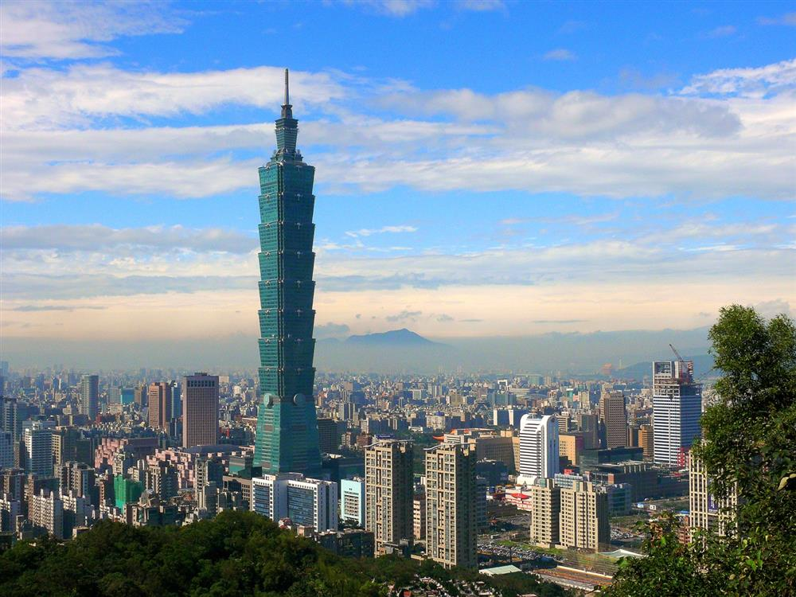
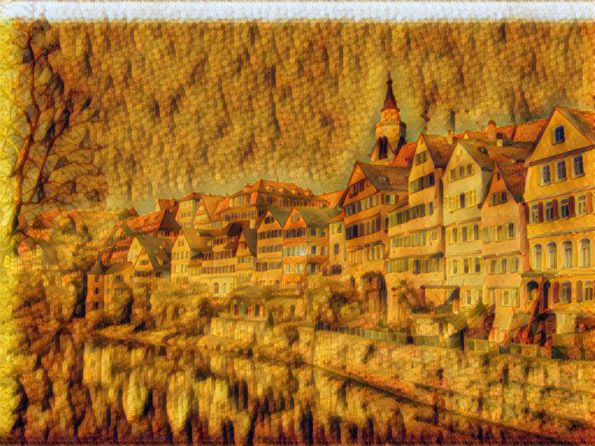
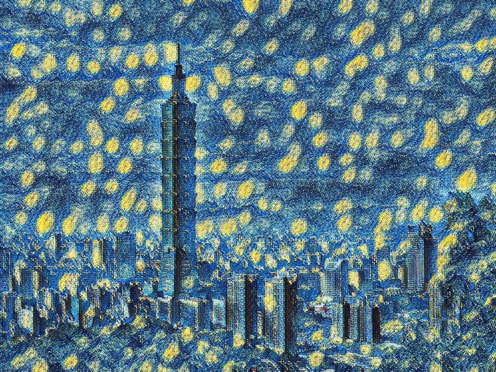
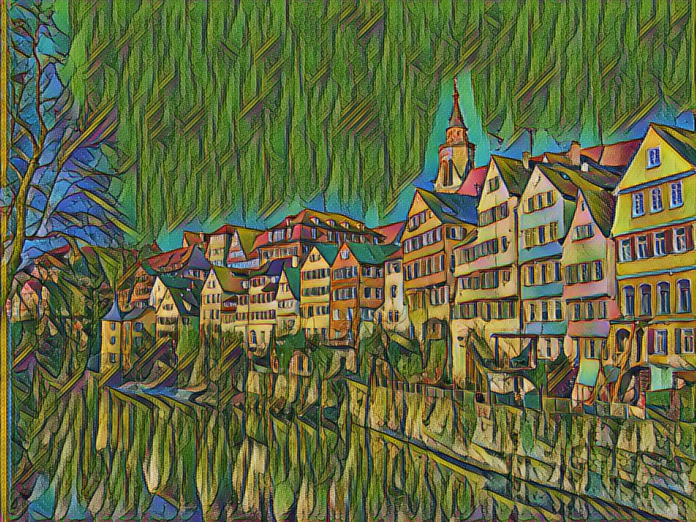
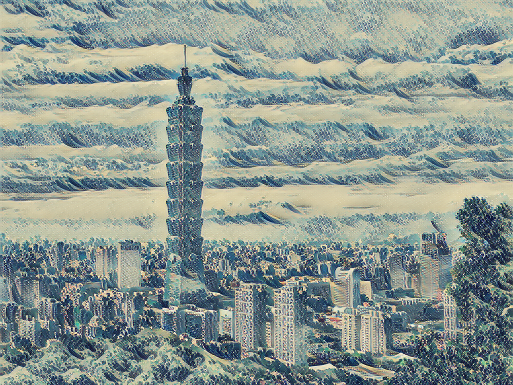

# fast-neural-style-keras

This is a fast neural style transfer implement with Keras 2(Tensorflow backend).  More detail please refer to  [Perceptual Losses for Real-Time Style Transfer and Super-Resolution](https://arxiv.org/abs/1603.08155)


## How to use
There are  some pretrained models in pretrained/
So you can use below command to transform your image.
```
python transform.py -i image/content/101.jpg -s la_muse -b 0.1 -o  out
```


## Some Examples




 
